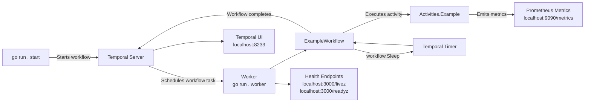

# temporal-go-starter

<!-- markdownlint-disable-next-line MD013 MD034 -->
[](https://goreportcard.com/report/github.com/mrsimonemms/temporal-go-starter)

A starter template for building [Temporal](https://temporal.io) applications
in Go.

The included workflow and activity are intentionally trivial. The value of this
template is the surrounding project structure, tooling, and developer
experience rather than the business logic itself.

<!-- toc -->

* [Why this template exists](#why-this-template-exists)
* [What this template demonstrates](#what-this-template-demonstrates)
* [Prerequisites](#prerequisites)
* [Getting started with Dev Containers](#getting-started-with-dev-containers)
* [Running the application](#running-the-application)
  * [1. Start a local Temporal server](#1-start-a-local-temporal-server)
  * [2. Run the worker](#2-run-the-worker)
  * [3. Trigger the sample workflow](#3-trigger-the-sample-workflow)
  * [4. View the workflow in the Temporal UI](#4-view-the-workflow-in-the-temporal-ui)
* [Observability and health checks](#observability-and-health-checks)
  * [Prometheus metrics](#prometheus-metrics)
  * [Health checks](#health-checks)
* [Project structure](#project-structure)
* [Testing and linting](#testing-and-linting)
* [Extending the template](#extending-the-template)
* [Troubleshooting](#troubleshooting)
* [Contributing](#contributing)
  * [Commit style](#commit-style)

<!-- Regenerate with "pre-commit run -a markdown-toc" -->

<!-- tocstop -->

## Why this template exists

Starting a Temporal project often involves repeatedly wiring together the same
supporting infrastructure: workers, configuration, linting, testing,
observability, health checks, and local development tooling.

This repository provides those pieces in a small, understandable starting point
so you can focus on implementing workflows and activities.

## What this template demonstrates

The following diagram shows the high-level flow of the sample application:



* A Temporal worker and starter wired together with [Cobra](https://github.com/spf13/cobra)
  and [Viper](https://github.com/spf13/viper) for CLI structure and configuration
* A simple workflow that calls an activity and then sleeps
* Typed input and result structs for both workflow and activity
* Structured logging via [zerolog](https://github.com/rs/zerolog)
* Prometheus metrics, health checks, and graceful shutdown
* Example unit tests using the Temporal Go SDK test suite
* A pre-configured Dev Container, `golangci-lint` setup, and `pre-commit` hooks

The sample workflow does the following:

1. Runs an activity that takes roughly 5 seconds and returns a sample response
2. Sleeps for roughly 5 seconds inside the workflow
3. Returns a result containing the input ID and the activity response

## Prerequisites

If you use the recommended Dev Container setup, you only need:

* [Docker](https://www.docker.com/)
* [Visual Studio Code](https://code.visualstudio.com/) with the
  [Dev Containers extension](https://marketplace.visualstudio.com/items?itemName=ms-vscode-remote.remote-containers),
  or another editor that supports the
  [Dev Container specification](https://containers.dev/)

If you choose to run things outside the Dev Container, you will need to install
the following yourself:

* [Go](https://go.dev/) (see `go.mod` for the supported version)
* [Temporal CLI](https://docs.temporal.io/cli)
* [golangci-lint](https://golangci-lint.run/)
* [pre-commit](https://pre-commit.com/)

Environments outside the Dev Container are not the primary target. Issues that
are specific to a local toolchain may not be prioritised.

## Getting started with Dev Containers

Dev Containers are the recommended and supported development environment for
this project. The maintainer develops and tests this template using Dev
Containers, and the configuration provides Go, the Temporal CLI, `pre-commit`,
`golangci-lint`, and the other tooling out of the box.

1. Clone the repository.
2. Open the folder in VS Code.
3. When prompted, choose **Reopen in Container**. If you are not prompted, run
   the **Dev Containers: Reopen in Container** command from the command
   palette.
4. Wait for the container to build. The `postCreateCommand` will configure the
   workspace for you.

When the container starts, a local Temporal development server is launched
automatically via the VS Code task defined in
[.vscode/tasks.json](.vscode/tasks.json). The forwarded ports for Temporal
(`7233`), the Temporal UI (`8233`), and Prometheus metrics (`9090`) are listed
in [.devcontainer/devcontainer.json](.devcontainer/devcontainer.json).

## Running the application

The application exposes three subcommands:

```sh
go run . --help
```

* `worker` runs a Temporal worker that polls for tasks
* `start` triggers a single run of the sample workflow
* `version` prints the build version and Git commit

### 1. Start a local Temporal server

Inside the Dev Container, a development server is started automatically. To
run it manually, use:

```sh
temporal server start-dev
```

By default this starts Temporal on `localhost:7233` and the Web UI on
`http://localhost:8233`.

### 2. Run the worker

In a separate terminal:

```sh
go run . worker
```

The worker registers `ExampleWorkflow` and the `Activities.Example` activity
on the task queue defined in [internal/app/constants.go](internal/app/constants.go).

### 3. Trigger the sample workflow

In another terminal:

```sh
go run . start
```

This starts the workflow, waits for it to complete, and prints the result.

### 4. View the workflow in the Temporal UI

Open [http://localhost:8233](http://localhost:8233) in your browser. You will
see the workflow run, including its event history, the activity invocation,
and the timer used by `workflow.Sleep`.

## Observability and health checks

The worker exposes Prometheus metrics and HTTP health endpoints out of the
box. They are intentionally simple, but they are wired up the way you would
want them in production so customers can use this template as a starting
point for a real Temporal worker.

### Prometheus metrics

Metrics are exposed on <localhost:9090/metrics>.

You get two layers of metrics for free:

* **Temporal SDK metrics**, covering worker poll counts, task latencies,
  activity and workflow execution rates, and similar runtime signals. These
  are useful for monitoring worker health, understanding workflow throughput,
  and building Grafana dashboards on top of a Prometheus scrape.
* **Application metrics**, defined in
  [internal/observability/prometheus.go](internal/observability/prometheus.go).
  These are intentionally lightweight examples showing where application-level
  instrumentation should live in a Temporal worker.

Two custom metrics are registered:

* `example_started_total`  counter incremented when the example activity starts
* `example_duration_seconds`  histogram recording the duration of the example
  activity

To add your own metrics, declare them in `internal/observability/` and
increment or observe them from your activities. Keep custom instrumentation
out of workflow code so that workflows stay deterministic.

### Health checks

Health endpoints are exposed on <localhost:3000/livez> and <localhost:3000/readyz>.

* `livez` checks that the worker process can reach Temporal via the Temporal
  client health check. Use it as a Kubernetes liveness probe to detect a
  process that cannot communicate with Temporal and should be restarted.
* `readyz` checks that Temporal is reachable and that the configured task
  queues are available for both workflow and activity task polling. Use it as
  a Kubernetes readiness probe so work is only routed to workers that are
  connected and ready to process tasks.

The readiness response includes per-task-queue health details, including
separate workflow and activity checks. This makes it useful both for
Kubernetes probes and for debugging worker startup issues locally.

The `/health` endpoint is also available as an alias for `readyz`.

These endpoints exist as sensible defaults for deployments in orchestration
platforms such as Kubernetes. They do not need to be touched for local
development.

## Project structure

```text
.
|-- cmd/                      Cobra commands (worker, start, version)
|-- internal/
|   |-- app/
|   |   |-- activities/       Activity implementations and IO types
|   |   |-- workflows/        Workflow implementations and IO types
|   |   `-- constants.go      Task queue name and other shared constants
|   `-- observability/        Custom Prometheus metrics
|-- main.go                   Entry point
|-- .devcontainer/            Dev Container configuration
|-- .github/workflows/        CI configuration
`-- .pre-commit-config.yaml   Pre-commit hooks
```

The `cmd` package wires Cobra commands to the worker and starter. The
`internal/app` packages hold the workflow and activity code, kept separate so
that workflows do not depend on activity implementations directly.

## Testing and linting

Run the tests:

```sh
go test ./...
```

Run the linter:

```sh
golangci-lint run
```

Run all pre-commit hooks against the whole tree:

```sh
pre-commit run -a
```

If you do not yet have `pre-commit` installed:

```sh
pip install pre-commit
pre-commit install
```

## Extending the template

To add your own workflows and activities:

1. Add new workflow functions under `internal/app/workflows/`. Keep them
   deterministic: no wall-clock time, randomness, goroutines, or direct I/O.
   Use the helpers on `workflow.Context` for anything that depends on
   external state.
2. Add new activity methods on the `Activities` struct under
   `internal/app/activities/`. Activities are where side effects belong
   (network calls, database access, file system access, randomness, and so on).
3. Register the new workflows and activities in [cmd/worker.go](cmd/worker.go).
4. Add tests next to the code, following the patterns in the existing
   `_test.go` files.
5. If your activities need shared dependencies (a database handle, an HTTP
   client, configuration), add fields to `Activities` and construct them in
   `NewActivities` in [internal/app/activities/activities.go](internal/app/activities/activities.go).

## Troubleshooting

**The worker cannot connect to Temporal.** Confirm a Temporal server is running
on `localhost:7233`. Inside the Dev Container, check the VS Code terminal that
runs the `Run Temporal server` task. Outside the Dev Container, run
`temporal server start-dev`.

**`go run . start` exits with an error before the workflow completes.** Make
sure the worker is also running. Without a worker registered on the task
queue, the workflow will be scheduled but never executed.

**Port already in use.** The dev server uses `7233`, `8233`, and `9090`. Stop
any other process bound to those ports, or change the configuration accordingly.

**Pre-commit hook fails after a fresh clone.** Run `pre-commit install` once
to install the Git hooks, then re-run `pre-commit run -a`.

**Workflow shows up in the UI but never finishes.** Check the worker logs.
The most common cause is that the workflow or activity has not been
registered on the worker, or the task queue name does not match.

## Contributing

This repository is configured for Dev Containers by default. See
[Getting started with Dev Containers](#getting-started-with-dev-containers).

### Commit style

All commits must use the [Conventional Commit](https://www.conventionalcommits.org)
format.

```git
<type>[optional scope]: <description>

[optional body]

[optional footer(s)]
```
